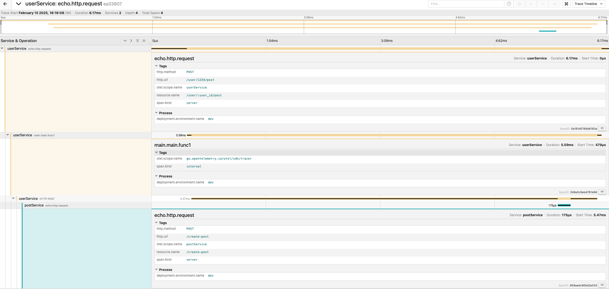

## Rustic - A minimalistic HTTP client in Go

Yet another HTTP Client in go with very simple yet essential features


[](https://pkg.go.dev/github.com/rag594/rustic)

Features:
- [x] http client with type safety
- [x] Different http configurations support
- [x] Configure timeouts, circuitBreaker etc
- [x] supports open telemetry, currently with stdOut exporter(can be changed to http exported in order to collect with any telemetry backend)
- [ ] Add metrics either via open telemetry or prometheus metrics

> **_NOTE:_**  For circuit breaker https://github.com/sony/gobreaker is used.

### Usage

```shell
go get github.com/rag594/rustic
```

### How to use it

```go
// UserPost represents the post/blog by a specific user 
type UserPost struct {
	UserId int    `json:"userId"`
	Id     int    `json:"id"`
	Title  string `json:"title"`
	Body   string `json:"body"`
}
```

```go
// configure your http client
client := httpClient.NewHTTPClient(httpClient.WithTraceEnabled(true))
url := "https://jsonplaceholder.typicode.com/posts"

// define your query params
params := url2.Values{}
params.Add("userId", "1")

// configure your circuit breaker(currently only sony circuit breaker is supported)
st := &gobreaker.Settings{}
st.Name = "HTTP GET"

st.ReadyToTrip = func(counts gobreaker.Counts) bool {
        failureRatio := float64(counts.TotalFailures) / float64(counts.Requests)
        return counts.Requests >= 3 && failureRatio >= 0.6
}

cb := gobreaker.NewCircuitBreaker[any](*st)
```

##### Trigger HTTP client

```go
post, err := rustic.GET[[]UserPost](context.Background(),
        url,
        rustic.WithQueryParams(params),
        rustic.WithHttpClient(client),
        rustic.WithTimeout(time.Duration(1)*time.Second),
        rustic.WithCircuitBreaker(cb), 
			)
    if err != nil {
        fmt.Println(err)
    }

    fmt.Println(post)
```

##### Using with Echo Framework

Initialise the trace with service name, environment and exporter()below is an OTLP exporter with configured telemetry backend. That's it, you have configured the traces
```go
// you can try out with tracer.StdOutExporter() in your localhost
	shutdown := rusticTracer.InitTracer("userService", "dev", rusticTracer.OTLPExporter("localhost", "4318"))

	defer shutdown()
	e.Use(rusticTracer.Echov4TracerMiddleware("userService"))
```
You can run the sample under `example/echoTraceMiddleware` and observe the trace as below:




##### Important information wrt context

1. If you pass the context as nil, then context is set as `Background`
2. If you pass the timeout, new context is derived from parent context
3. If you wish to maintain context timeout at the parent level, do not pass timeout
