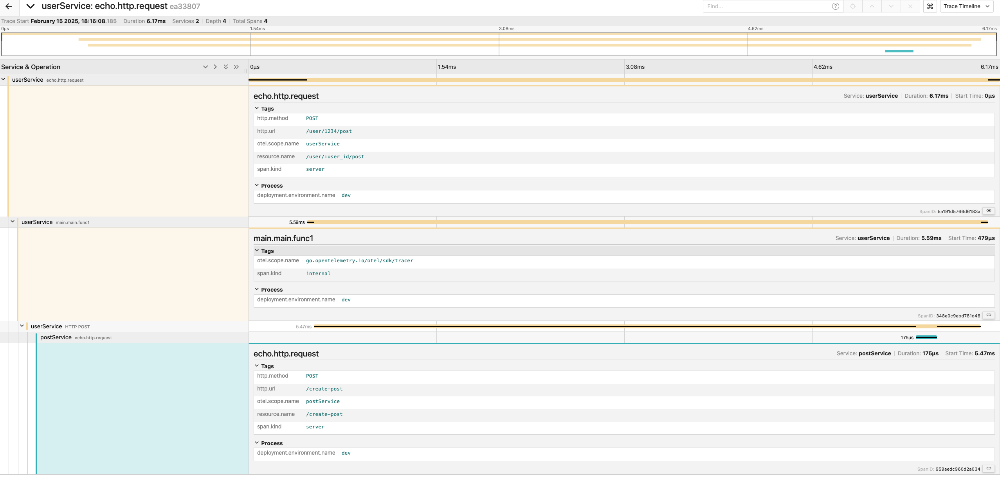

## Rustic - A minimalistic library in Go for HTTP Client and tracing constructs

Yet another HTTP Client in go with very simple yet essential features


[](https://pkg.go.dev/github.com/rag594/rustic)

### Features of HTTPClient
- [x] http client with type safety
- [x] Different http configurations support - Timeout, Headers, QueryParams, FormParams, MultipartFormParams, CircuitBreaker
- [x] Supports GET, POST, POSTMultiPartFormData, POSTFormData, PUT
  - [ ] DELETE, PATCH
- [x] Add metrics via OpenTelemetry
- [ ] Add support for retries, it should have either default/custom or without any retrier

### Features of Tracing constructs
- [x] supports opentelemetry - stdOut and OTLP Http exporter
- [x] tracing middleware for echo v3 and v4

> **_NOTE:_**  For circuit breaker https://github.com/sony/gobreaker is used.

### Usage

```shell
go get github.com/rag594/rustic
```

### How to use it

#### HTTP Client

```go
// UserPost represents the post/blog by a specific user 
type UserPost struct {
	UserId int    `json:"userId"`
	Id     int    `json:"id"`
	Title  string `json:"title"`
	Body   string `json:"body"`
}
```

Initialise tracer for HTTP client

```go
shutdown := rusticTracer.InitTracer("microserviceA", "dev", rusticTracer.StdOutExporter())
defer shutdown()
```

```go
// configure your http client
client := httpClient.NewHTTPClient(httpClient.WithTraceEnabled(true))
url := "https://jsonplaceholder.typicode.com/posts"

// define your query params
params := url2.Values{}
params.Add("userId", "1")

// configure your circuit breaker(currently only sony circuit breaker is supported)
st := &gobreaker.Settings{}
st.Name = "HTTP GET"

st.ReadyToTrip = func(counts gobreaker.Counts) bool {
        failureRatio := float64(counts.TotalFailures) / float64(counts.Requests)
        return counts.Requests >= 3 && failureRatio >= 0.6
}

cb := gobreaker.NewCircuitBreaker[any](*st)
```

##### Trigger HTTP client

```go
post, err := rustic.GET[[]UserPost](context.Background(),
        url,
        rustic.WithQueryParams(params),
        rustic.WithHttpClient(client),
        rustic.WithTimeout(time.Duration(1)*time.Second),
        rustic.WithCircuitBreaker(cb), 
			)
    if err != nil {
        fmt.Println(err)
    }

    fmt.Println(post)
```

#### HTTP Client OpenTelemetry Metrics

The HTTP client can be configured to emit OpenTelemetry metrics, allowing you to monitor its performance and behavior, such as request counts, durations, and errors.

##### Enabling Metrics

To enable metrics collection, use the `WithMetricsEnabled` option when creating a new `HTTPClient`:

```go
import (
	"learn-go-dependency-injection/httpClient" // Or your actual import path
	// ... other necessary imports for metrics exporter
)

// Example: Create a client with metrics enabled
client := httpClient.NewHTTPClient(
    httpClient.WithMetricsEnabled(true),
    // You might also want to enable tracing or other options
    // httpClient.WithTraceEnabled(true),
)

// Now, when client.Do is called, metrics will be recorded.
```

##### Collected Metrics

When enabled, the client records the following metrics:

*   **`http.client.request.count`** (Counter): The total number of HTTP requests made.
    *   Attributes: `http.method`, `http.url`, `http.status_code` (if a response is received).
*   **`http.client.request.duration`** (Histogram): The duration of each HTTP request in seconds.
    *   Attributes: `http.method`, `http.url`, `http.status_code` (if a response is received).
*   **`http.client.request.errors`** (Counter): The number of HTTP requests that resulted in an error during the request execution (e.g., network errors, dial errors). This does not count HTTP status codes like 4xx or 5xx as errors for this specific metric unless the `Do` method itself returns an error.
    *   Attributes: `http.method`, `http.url`.

##### Setting up an Exporter

To actually collect and visualize these metrics, you need to configure an OpenTelemetry metrics exporter and a `MeterProvider` in your application. This setup is standard for OpenTelemetry.

For a practical example of how to set up a simple stdout exporter (which prints metrics to the console), please refer to the example program:
[`example/httpMetrics/main.go`](./example/httpMetrics/main.go)

This example demonstrates initializing the exporter and making it available for the `HTTPClient` to use. You can replace the stdout exporter with other exporters like Prometheus, OTLP, etc., depending on your monitoring infrastructure.


#### Opentelementry Tracing

##### Using with Echo Framework

Initialise the trace with service name, environment and exporter()below is an OTLP exporter with configured telemetry backend. That's it, you have configured the traces
```go
// you can try out with tracer.StdOutExporter() in your localhost
	shutdown := rusticTracer.InitTracer("userService", "dev", rusticTracer.OTLPExporter("localhost", "4318"))

	defer shutdown()
	e.Use(rusticTracer.Echov4TracerMiddleware("userService"))
```
You can run the sample under `example/echoTraceMiddleware` and observe the trace as below:




##### Important information wrt context

1. If you pass the context as nil, then context is set as `Background`
2. If you pass the timeout, new context is derived from parent context
3. If you wish to maintain context timeout at the parent level, do not pass timeout
